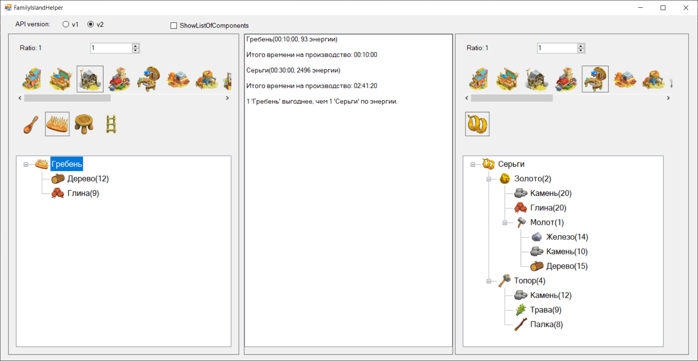

# FamilyIslandHelper

Helper for game [FamilyIsland](https://play.google.com/store/apps/details?id=com.MelsoftGames.FamilyIslandFarm&pcampaignid=web_share)

Windows Application:

## Packages

| Package | NuGet.org |
|---------|-----------|
| `FamilyIslandHelper.Api` |  |

## CI-CD

| Workflow     | Status                                   |
|--------------|------------------------------------------|
| main         |  |
| web          |  |
| api          |  |

## Deployed web version

https://gruuuubik.bsite.net/

## Authors

- [@Gruuuubik](https://www.github.com/Gruuuubik)
